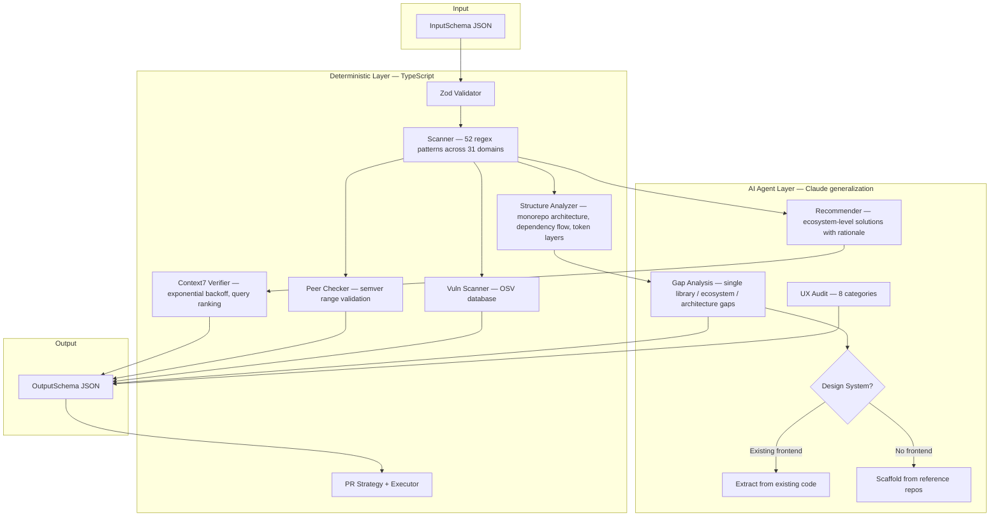

<p align="center">
  <h1 align="center">Next-Unicorn</h1>
  <p align="center">
    Stop Vibe Coding debt. Audit your codebase, replace reinvented wheels with<br/>
    unicorn-grade libraries, and ship a migration plan + "delete-code" checklist.
  </p>
</p>

<p align="center">
  <a href="https://smithery.ai/skills/nebutra/next-unicorn-skill"></a>
  <a href="https://github.com/Nebutra/Next-Unicorn-Skill/actions/workflows/ci.yml"></a>
  <a href="https://www.npmjs.com/package/@nebutra/next-unicorn-skill"></a>
  <a href="https://www.npmjs.com/package/@nebutra/next-unicorn-skill"></a>
  <a href="https://github.com/Nebutra/Next-Unicorn-Skill/stargazers"></a>
  <a href="./LICENSE"></a>
  <a href="https://www.typescriptlang.org/"></a>
  <a href="./tests/"></a>
  <a href="./tests/"></a>
</p>

<p align="center">
  <b>English</b> | <a href="./README.zh-CN.md">简体中文</a>
</p>

<p align="center">
  <a href="#quick-start">Quick Start</a> &bull;
  <a href="#features">Features</a> &bull;
  <a href="#how-it-works">How It Works</a> &bull;
  <a href="#comparison">Comparison</a> &bull;
  <a href="#api">API</a> &bull;
  <a href="#examples">Examples</a> &bull;
  <a href="#contributing">Contributing</a>
</p>

---

## Why Next-Unicorn?

Every codebase accumulates hand-rolled implementations that should be mature libraries. Custom date formatters, DIY loggers, bespoke state machines, ad-hoc i18n — **Vibe Coding debt**.

Snyk, Dependabot, and Renovate manage your *existing* dependencies. They can't find code you wrote that *should become* a dependency — or capabilities your project is *missing entirely*.

**Next-Unicorn does all three** — replacement, gap analysis, and dependency management — verified against real documentation via [Context7 MCP](https://context7.com).

## Quick Start

### From Smithery (recommended)

Browse and install directly from the Smithery skill registry:

> **[Next-Unicorn on Smithery](https://smithery.ai/skills/nebutra/next-unicorn-skill)**

### From npmjs.org

```bash
npm install @nebutra/next-unicorn-skill
# or
pnpm add @nebutra/next-unicorn-skill
```

### From GitHub Packages

Configure your `.npmrc` first:

```shell
echo "@nebutra:registry=https://npm.pkg.github.com" >> .npmrc
```

Then install:

```bash
npm install @nebutra/next-unicorn-skill
```

```typescript
import { analyze, scanCodebase } from '@nebutra/next-unicorn-skill';
import type { Recommender, GapRecommendation } from '@nebutra/next-unicorn-skill';

// The recommender: AI agent decides which library fits each detection
const recommender: Recommender = (detection) => ({
  library: '@lingui/core',
  version: '^4.0.0',
  license: 'MIT',
  rationale: 'Compile-time i18n with near-zero runtime overhead',
  ecosystem: [
    { library: '@lingui/macro', version: '^4.0.0', role: 'Tagged templates' },
    { library: '@lingui/cli', version: '^4.0.0', role: 'CI message extraction' },
  ],
  antiPatterns: ['Avoid i18next if bundle size matters — Lingui compiles away'],
  alternatives: [
    { library: 'next-intl', when: 'Next.js App Router with server components' },
  ],
});

// Gap analysis: capabilities the project should have but doesn't
const gaps: GapRecommendation[] = [
  {
    domain: 'observability',
    description: 'No structured logging detected',
    recommendedLibrary: {
      name: 'pino', version: '^9.0.0', license: 'MIT',
      rationale: 'Fastest Node.js JSON logger with redaction and child loggers',
    },
    priority: 'critical',
  },
];

const result = await analyze({
  input: {
    projectMetadata: {
      repoPath: './my-project',
      languages: ['typescript'],
      packageManagers: ['pnpm'],
      currentLibraries: { react: '18.2.0', next: '14.1.0' },
    },
    optimizationGoals: ['reduce custom code', 'improve maintainability'],
    constraints: { licenseAllowlist: ['MIT', 'Apache-2.0', 'ISC'] },
    priorityFocusAreas: ['i18n', 'observability', 'auth-security'],
  },
  context7Client: myContext7Client,
  recommender,
  gaps,
});

if (result.success) {
  console.log(result.prettyJson);
  // result.scanResult — raw detections + structural findings for AI analysis
  // result.output.gapAnalysis — Context7-verified gap recommendations
}
```

Or use as an **MCP SKILL** — provide [`SKILL.md`](./SKILL.md) to your AI agent (Claude Code, Kiro, Cursor, etc.).

## Features

### Core Analysis

| Feature | Description |
|---------|-------------|
| **Pattern-based scanning** | Detects hand-rolled code across 31 domains with 52 regex patterns (design-system, auth, state-management, code-organization, etc.) |
| **Structural analysis** | Detects monorepo architecture gaps: missing token layers, dependency flow violations, hardcoded config values |
| **Gap analysis** | AI agent identifies missing capabilities — not just hand-rolled code, but things you should have but don't |
| **Ecosystem-level recommendations** | Solutions include rationale, companion packages, anti-patterns, and alternatives |
| **Context7 verification** | Every recommendation (replacements AND gaps) verified with exponential backoff retry |
| **7-dimension impact scoring** | Scalability, performance, security, maintainability, feature richness, UX, UI aesthetics |
| **Phased migration plans** | Low / medium / high risk phases with adapter strategies |
| **Deletion checklists** | Every file and line range to remove, with estimated lines saved |
| **UX completeness audit** | A11y, error/empty/loading states, form validation, design system alignment |
| **Design system support** | Two paths: scaffold from reference repos (Primer, Polaris, Supabase, Dub) or extract from existing code |
| **Code organization analysis** | Detects god directories, mixed naming conventions, deep nesting, barrel bloat, catch-all directories, and circular dependencies via import graph traversal |
| **Human-in-the-loop gates** | 4 structured decision gates at irreversible/preference-driven points — triage, preferences (SWOT), accept/reject, execution confirmation |
| **Monorepo support** | Detects npm, pip, cargo, go workspaces independently |

### Dependency Management

| Feature | Description |
|---------|-------------|
| **Vulnerability scanning** | Scans current AND recommended deps via OSV — prevents "upgrade into a vuln" |
| **Auto-update deps** | Impact-scored version upgrades with Context7-powered breaking change detection |
| **PR auto-creation** | GitHub/GitLab PRs with conventional commit titles, impact tables, reviewer checklists |
| **Migration PRs** | PRs with adapter code scaffolding for hand-rolled code replacement |

## How It Works

### Architecture Diagram



### Design Principles

| Principle | Implementation |
|-----------|---------------|
| **Occam's Razor** | Only 17 TS modules remain — each does something Claude cannot (regex, semver, file I/O, API calls, import graph traversal). Scoring, planning, UX audit, PR descriptions are AI-agent-driven. |
| **No hardcoded recommendations** | Pattern catalog contains zero library names. The `Recommender` callback and `GapRecommendation` are filled by the AI agent at runtime. |
| **Context7 best practices** | Exponential backoff (3 retries), query parameter for ranking, per-library isolation. Both replacements and gaps are verified. |
| **Progressive disclosure** | SKILL.md is 111 lines. `references/` files load only when design system gaps are detected. |
| **Two analysis modes** | **Replacement**: scanner finds hand-rolled code → agent recommends library. **Gap**: agent identifies missing capabilities → verified via Context7. |
| **Design system support** | Structure analyzer detects missing layers. Two paths: scaffold from 25+ reference repos, or extract spec from existing code (6 principles, 5 phases). |

Each stage is a pure function with structured I/O. All external dependencies (Context7, OSV, npm registry, GitHub API) are **injected via interfaces** for testability.

### Before / After

<table>
<tr><th>Before (hand-rolled)</th><th>After (recommended)</th></tr>
<tr>
<td>

```tsx
// Custom i18n across 47 files
const translations = {
  en: { greeting: 'Hello' },
  es: { greeting: 'Hola' },
};
function t(key, locale) {
  return translations[locale]?.[key] ?? key;
}
// No plurals, no interpolation, no RTL
```

</td>
<td>

```tsx
// @lingui/core — Context7 verified, MIT
// Ecosystem: @lingui/macro + @lingui/cli
// Impact: 9.2/10 | Risk: low | Effort: 8h
import { useLingui } from '@lingui/react';

export default function Page() {
  const { t } = useLingui();
  return <h1>{t`greeting`}</h1>;
}
```

</td>
</tr>
<tr>
<td>

```typescript
// Custom logger with console.log
function logRequest(req) {
  console.log(JSON.stringify({
    time: new Date().toISOString(),
    method: req.method,
    url: req.url,
  }));
}
// No levels, no redaction, no rotation
```

</td>
<td>

```typescript
// pino — Context7 verified, MIT
// Gap analysis: "No structured logging detected"
// Priority: critical
import pino from 'pino';
const logger = pino({
  level: 'info',
  redact: ['req.headers.authorization'],
});
```

</td>
</tr>
</table>

## Comparison

| Feature | Next-Unicorn | Snyk | Dependabot | Renovate |
|---------|:---:|:---:|:---:|:---:|
| Finds hand-rolled code to replace | **Yes** | | | |
| Identifies missing capabilities (gaps) | **Yes** | | | |
| Structural architecture analysis | **Yes** | | | |
| Recommends new libraries | **Yes** | | | |
| Ecosystem-level solutions | **Yes** | | | |
| 7-dimension impact scoring | **Yes** | | | |
| Context7 doc verification | **Yes** | | | |
| Phased migration plans | **Yes** | | | |
| UX completeness audit | **Yes** | | | |
| Design system scaffold/extraction | **Yes** | | | |
| Code organization analysis | **Yes** | | | |
| Human-in-the-loop gates | **Yes** | | | |
| Deletion checklists | **Yes** | | | |
| Vulnerability scanning | **Yes** | Yes | Yes | |
| Scans *recommended* libs for vulns | **Yes** | | | |
| Auto-update existing deps | **Yes** | | Yes | Yes |
| Impact-scored updates | **Yes** | | | |
| PR auto-creation | **Yes** | Yes | Yes | Yes |
| Migration PRs with adapter code | **Yes** | | | |
| License compliance | **Yes** | Yes | | |
| Monorepo support | **Yes** | Yes | Yes | Yes |

## API

### `analyze(options): Promise<AnalyzeResult>`

| Option | Type | Required | Description |
|--------|------|:--------:|-------------|
| `input` | `InputSchema` | Yes | Project metadata, goals, constraints, focus areas |
| `context7Client` | `Context7Client` | Yes | Context7 MCP client for doc verification |
| `recommender` | `Recommender` | Yes | Maps each detection → library recommendation (AI agent provides this) |
| `gaps` | `GapRecommendation[]` | No | Missing capabilities the project should have (AI agent identifies these) |
| `vulnClient` | `VulnerabilityClient` | No | OSV client for vulnerability scanning |
| `registryClient` | `RegistryClient` | No | Package registry client for auto-update |
| `platformClient` | `PlatformClient` | No | GitHub/GitLab client for PR creation |
| `gitOps` | `GitOperations` | No | Git CLI operations for PR creation |

### `scanCodebase(input): Promise<ScanResult>`

Standalone scanner — returns detections, workspace info, and structural findings (design system layer analysis, dependency flow violations). AI agents can call this first, then provide recommendations via the `Recommender` callback.

### `analyzeStructure(repoPath, workspaces): StructuralAnalysis`

Standalone structure analyzer — detects missing design system layers, dependency flow violations, hardcoded config values, and missing shared presets in monorepos.

### Output Structure

```jsonc
{
  "recommendedChanges": [...],     // Replacement recommendations with impact scores
  "gapAnalysis": [...],            // (optional) Context7-verified gap recommendations
  "filesToDelete": [...],          // Files to remove after migration
  "linesSavedEstimate": 1250,      // Total lines saved
  "uxAudit": [...],                // UX completeness (8 categories)
  "migrationPlan": {               // Phased plan
    "phases": [...],               // low → medium → high risk
    "deletionChecklist": [...]     // Detailed items with reasons
  },
  "vulnerabilityReport": {...},    // (optional) Vuln findings + SARIF
  "updatePlan": {...},             // (optional) Scored dep updates
  "pullRequests": {...}            // (optional) Created PR results
}
```

## Vibe Coding Domains

69 domains across 12 categories, aligned with ISO/IEC 25010. 31 domains have scanner patterns; the rest are covered by AI agent gap analysis.

| Category | Count | Examples |
|----------|:-----:|---------|
| UX / Design | 14 | `design-system`, `a11y-accessibility`, `forms-ux`, `empty-loading-error-states` |
| SEO / i18n | 5 | `seo`, `i18n`, `content-marketing` |
| Growth / Data | 7 | `analytics-tracking`, `ab-testing-experimentation` |
| Frontend Arch | 8 | `state-management`, `data-fetching-caching`, `realtime-collaboration` |
| Backend / Platform | 8 | `database-orm-migrations`, `caching-rate-limit`, `feature-flags-config` |
| Security | 5 | `auth-security`, `security-hardening`, `fraud-abuse-prevention` |
| Observability | 4 | `logging-tracing-metrics`, `error-monitoring` |
| Code Organization | 1 | `code-organization` (god-dirs, naming, circular deps, barrel bloat, nesting, catch-all) |
| Delivery / DevEx | 6 | `testing-strategy`, `ci-cd-release`, `dependency-management` |
| Performance | 3 | `performance-web-vitals`, `cost-optimization` |
| AI Engineering | 3 | `ai-model-serving`, `rag-vector-search` |
| Business | 3 | `payments-billing`, `marketplace-platform` |

> Extensible via `customDomains` in the input schema.

## Testing

```bash
pnpm test          # 176 tests (vitest + fast-check)
pnpm typecheck     # TypeScript strict mode
pnpm build         # Compile to dist/
```

**29 property-based tests** verify correctness invariants:

- Schema round-trip guarantees (Properties 1–3)
- Detection completeness (Property 4)
- Context7 verification correctness (Property 5)
- Scoring range and composite correctness (Properties 6–7)
- Migration phase ordering and adapter mandates (Properties 8–10)
- UX audit completeness (Property 11)
- Constraint filtering (Properties 12–13)
- JSON indentation (Property 14)
- Vulnerability scanning (Properties 15–18)
- Update policy and scoring (Properties 19–24)
- PR strategy and formatting (Properties 25–29)

## Examples

| Scenario | Input | Output |
|----------|-------|--------|
| Next.js Frontend | [`examples/frontend-nextjs/input.json`](./examples/frontend-nextjs/input.json) | [`output.json`](./examples/frontend-nextjs/output.json) |
| Node.js Backend | [`examples/backend-node/input.json`](./examples/backend-node/input.json) | [`output.json`](./examples/backend-node/output.json) |

## Templates

| Template | Purpose |
|----------|---------|
| [`summary-table.md`](./templates/summary-table.md) | Comparison table for stakeholders |
| [`migration-plan.md`](./templates/migration-plan.md) | Phased migration plan |
| [`deletion-checklist.md`](./templates/deletion-checklist.md) | Files to delete after migration |
| [`vuln-report.md`](./templates/vuln-report.md) | Vulnerability scan report |
| [`update-plan.md`](./templates/update-plan.md) | Dependency update plan |
| [`prd-template.md`](./templates/prd-template.md) | PRD for stakeholder presentation |

## References

| Reference | Purpose |
|-----------|---------|
| [`design-system-sources.md`](./references/design-system-sources.md) | 25+ curated design system repos for scaffolding (Primer, Polaris, Dub, Supabase, etc.) |
| [`design-system-extraction.md`](./references/design-system-extraction.md) | Workflow for extracting a design system from existing code (6 principles, 5 phases) |
| [`code-organization-workflow.md`](./references/code-organization-workflow.md) | Code organization decision tree, Gate examples (SWOT), Phase A/B workflow with worked examples |

<!-- TODO: P1 — 项目 Logo: 设计一个 Logo 放在 README 顶部，同时用作 GitHub Social Preview -->
<!-- TODO: P1 — Social Preview / OG Image: 到 GitHub repo Settings → Social preview 上传卡片图 -->
<!-- TODO: P1 — Demo GIF: 录制 30 秒终端演示动图，放在 Quick Start 上方 -->
<!-- TODO: P0 — GitHub Topics: 到 GitHub repo Settings → Topics 添加: mcp, ai-agent, claude-code, codebase-analysis, dependency-management, vulnerability-scanning, migration, context7, vibe-coding, skill -->
<!-- TODO: P2 — Coverage 徽章: 配置 Codecov 或 Coveralls，在 CI 中上传覆盖率报告 -->
<!-- TODO: P2 — Twitter/X: 创建项目 Twitter 账号或用个人账号发布公告，在 README 添加链接 -->
<!-- TODO: P2 — Discord: 创建 Discord 服务器，在 README 添加邀请链接徽章 -->
<!-- TODO: P3 — Awesome Lists: 提交 PR 到 awesome-mcp、awesome-claude-code、awesome-ai-tools 等列表 -->
<!-- TODO: P3 — Product Hunt: 在 producthunt.com 发布项目 -->
<!-- TODO: P3 — Hacker News: 发布 Show HN 帖子 -->
<!-- TODO: P3 — GitHub Discussions: 到 GitHub repo Settings → Features → Discussions 开启 -->
<!-- TODO: P3 — "Who's Using" 展示区: 有用户后在 README 加 logo 墙 -->

## Star History

<a href="https://star-history.com/#Nebutra/Next-Unicorn-Skill&Date">
 <picture>
   <source media="(prefers-color-scheme: dark)" srcset="https://api.star-history.com/svg?repos=Nebutra/Next-Unicorn-Skill&type=Date&theme=dark" />
   <source media="(prefers-color-scheme: light)" srcset="https://api.star-history.com/svg?repos=Nebutra/Next-Unicorn-Skill&type=Date" />
   
 </picture>
</a>

## Contributing

See [CONTRIBUTING.md](./CONTRIBUTING.md) for development setup, architecture overview, and contribution guidelines.

## Security

See [SECURITY.md](./SECURITY.md) for our security policy and how to report vulnerabilities.

## Releasing

Releases are automated via GitHub Actions:

```bash
# Tag a new version
git tag v1.0.5
git push origin v1.0.5
# → CI runs tests → creates GitHub Release → publishes to npmjs + GitHub Packages
```

Packages are also published automatically on every push to `main` via the CI workflow.

> **Required Secrets**: `NPM_TOKEN` (npmjs.org publish token). `GITHUB_TOKEN` is provided automatically.

See [CHANGELOG.md](./CHANGELOG.md) for version history.

## License

[MIT](./LICENSE) &copy; [Nebutra](https://github.com/Nebutra)

---

## Installation via Vercel Skills

```bash
npx skills add Nebutra/Next-Unicorn-Skill
```

This will install the skill for supported AI agents including OpenCode, Claude Code, Codex, Cursor, and more.
