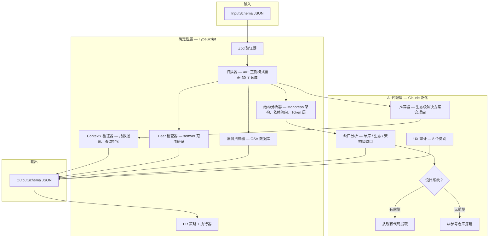

<p align="center">
  <h1 align="center">Next-Unicorn</h1>
  <p align="center">
    终结 Vibe Coding 技术债。审计你的代码库，用独角兽级别的<br/>
    第三方库替换重复造轮子的代码，并输出迁移方案 + "删除代码"清单。
  </p>
</p>

<p align="center">
  <a href="https://smithery.ai/skills/nebutra/next-unicorn-skill"></a>
  <a href="https://github.com/Nebutra/Next-Unicorn-Skill/actions/workflows/ci.yml"></a>
  <a href="https://www.npmjs.com/package/@nebutra/next-unicorn-skill"></a>
  <a href="https://www.npmjs.com/package/@nebutra/next-unicorn-skill"></a>
  <a href="https://github.com/Nebutra/Next-Unicorn-Skill/stargazers"></a>
  <a href="./LICENSE"></a>
  <a href="https://www.typescriptlang.org/"></a>
  <a href="./tests/"></a>
  <a href="./tests/"></a>
</p>

<p align="center">
  <a href="./README.md">English</a> | <b>简体中文</b>
</p>

<p align="center">
  <a href="#快速开始">快速开始</a> &bull;
  <a href="#功能特性">功能特性</a> &bull;
  <a href="#工作原理">工作原理</a> &bull;
  <a href="#方案对比">方案对比</a> &bull;
  <a href="#api-接口">API 接口</a> &bull;
  <a href="#示例">示例</a> &bull;
  <a href="#贡献指南">贡献指南</a>
</p>

---

## 为什么选择 Next-Unicorn？

每个代码库都会逐渐积累本应使用成熟第三方库的手写实现。自制的日期格式化器、DIY 日志器、临时状态机、草率的 i18n 方案——这些都是 **Vibe Coding 技术债**。

Snyk、Dependabot 和 Renovate 管理的是你*已有*的依赖。它们无法发现你写了但*应该替换为*依赖的代码，也无法发现项目*完全缺失*的能力。

**Next-Unicorn 三管齐下** —— 替换分析、缺口分析和依赖管理 —— 所有推荐均通过 [Context7 MCP](https://context7.com) 进行真实文档验证。

## 快速开始

### 从 Smithery 安装（推荐）

在 Smithery 技能市场中浏览并直接安装：

> **[Next-Unicorn on Smithery](https://smithery.ai/skills/nebutra/next-unicorn-skill)**

### 从 npmjs.org 安装

```bash
npm install @nebutra/next-unicorn-skill
# 或
pnpm add @nebutra/next-unicorn-skill
```

### 从 GitHub Packages 安装

先配置 `.npmrc`：

```shell
echo "@nebutra:registry=https://npm.pkg.github.com" >> .npmrc
```

然后安装：

```bash
npm install @nebutra/next-unicorn-skill
```

```typescript
import { analyze, scanCodebase } from '@nebutra/next-unicorn-skill';
import type { Recommender, GapRecommendation } from '@nebutra/next-unicorn-skill';

// 推荐器：AI 代理决定每个检测结果应使用哪个库
const recommender: Recommender = (detection) => ({
  library: '@lingui/core',
  version: '^4.0.0',
  license: 'MIT',
  rationale: '编译时 i18n，近乎零运行时开销',
  ecosystem: [
    { library: '@lingui/macro', version: '^4.0.0', role: '标签模板' },
    { library: '@lingui/cli', version: '^4.0.0', role: 'CI 消息提取' },
  ],
  antiPatterns: ['如果在意包体积，避免使用 i18next —— Lingui 会在编译时消除'],
  alternatives: [
    { library: 'next-intl', when: '使用 Next.js App Router 和服务端组件时' },
  ],
});

// 缺口分析：项目应有但未实现的能力
const gaps: GapRecommendation[] = [
  {
    domain: 'observability',
    description: '未检测到结构化日志',
    recommendedLibrary: {
      name: 'pino', version: '^9.0.0', license: 'MIT',
      rationale: '最快的 Node.js JSON 日志库，支持数据脱敏和子日志器',
    },
    priority: 'critical',
  },
];

const result = await analyze({
  input: {
    projectMetadata: {
      repoPath: './my-project',
      languages: ['typescript'],
      packageManagers: ['pnpm'],
      currentLibraries: { react: '18.2.0', next: '14.1.0' },
    },
    optimizationGoals: ['减少自定义代码', '提升可维护性'],
    constraints: { licenseAllowlist: ['MIT', 'Apache-2.0', 'ISC'] },
    priorityFocusAreas: ['i18n', 'observability', 'auth-security'],
  },
  context7Client: myContext7Client,
  recommender,
  gaps,
});

if (result.success) {
  console.log(result.prettyJson);
  // result.scanResult — 原始检测结果 + 结构化发现，供 AI 分析使用
  // result.output.gapAnalysis — Context7 验证过的缺口推荐
}
```

或作为 **MCP SKILL** 使用 —— 将 [`SKILL.md`](./SKILL.md) 提供给你的 AI 代理（Claude Code、Kiro、Cursor 等）。

## 功能特性

### 核心分析

| 功能 | 描述 |
|------|------|
| **基于模式的扫描** | 使用 40+ 正则模式跨 30 个领域检测手写代码（设计系统、认证、状态管理等） |
| **结构分析** | 检测 Monorepo 架构缺陷：缺失的 Token 层、依赖流向违规、硬编码配置值 |
| **缺口分析** | AI 代理识别缺失的能力 —— 不仅是手写代码，还包括你应有但没有的东西 |
| **生态级推荐** | 解决方案包含理由、配套包、反模式和替代方案 |
| **Context7 验证** | 每条推荐（替换和缺口）均经过指数退避重试验证 |
| **7 维影响评分** | 可扩展性、性能、安全性、可维护性、功能丰富度、用户体验、UI 美观度 |
| **分阶段迁移计划** | 低 / 中 / 高风险阶段，含适配器策略 |
| **删除清单** | 列出每个待删文件和行范围，附预估节省行数 |
| **UX 完整性审计** | 无障碍、错误/空/加载状态、表单验证、设计系统对齐 |
| **设计系统支持** | 两条路径：从参考仓库搭建（Primer、Polaris、Supabase、Dub）或从现有代码中提取 |
| **Monorepo 支持** | 独立检测 npm、pip、cargo、go 工作区 |

### 依赖管理

| 功能 | 描述 |
|------|------|
| **漏洞扫描** | 通过 OSV 扫描当前和推荐的依赖 —— 防止"升级引入漏洞" |
| **自动更新依赖** | 基于影响评分的版本升级，通过 Context7 检测破坏性变更 |
| **自动创建 PR** | GitHub/GitLab PR，包含常规提交标题、影响表格、审查清单 |
| **迁移 PR** | 包含适配器代码脚手架的 PR，用于替换手写代码 |

## 工作原理

### 架构图



### 设计原则

| 原则 | 实现方式 |
|------|----------|
| **奥卡姆剃刀** | 仅保留 16 个 TS 模块 —— 每个模块做 Claude 无法做的事（正则、semver、文件 I/O、API 调用）。评分、规划、UX 审计、PR 描述由 AI 代理驱动。 |
| **不硬编码推荐** | 模式目录中不包含任何库名。`Recommender` 回调和 `GapRecommendation` 由 AI 代理在运行时填充。 |
| **Context7 最佳实践** | 指数退避（3 次重试），用于排序的查询参数，按库隔离。替换和缺口均经过验证。 |
| **渐进式披露** | SKILL.md 仅 111 行。`references/` 文件仅在检测到设计系统缺口时加载。 |
| **双分析模式** | **替换**：扫描器发现手写代码 → 代理推荐库。**缺口**：代理识别缺失能力 → 通过 Context7 验证。 |
| **设计系统支持** | 结构分析器检测缺失层。两条路径：从 25+ 参考仓库搭建，或从现有代码提取规范（6 原则，5 阶段）。 |

每个阶段都是具有结构化 I/O 的纯函数。所有外部依赖（Context7、OSV、npm 注册表、GitHub API）均通过**接口注入**以保证可测试性。

### 前后对比

<table>
<tr><th>之前（手写实现）</th><th>之后（推荐方案）</th></tr>
<tr>
<td>

```tsx
// 自定义 i18n 散布在 47 个文件中
const translations = {
  en: { greeting: 'Hello' },
  es: { greeting: 'Hola' },
};
function t(key, locale) {
  return translations[locale]?.[key] ?? key;
}
// 无复数、无插值、无 RTL 支持
```

</td>
<td>

```tsx
// @lingui/core — Context7 已验证，MIT
// 生态：@lingui/macro + @lingui/cli
// 影响：9.2/10 | 风险：低 | 工时：8h
import { useLingui } from '@lingui/react';

export default function Page() {
  const { t } = useLingui();
  return <h1>{t`greeting`}</h1>;
}
```

</td>
</tr>
<tr>
<td>

```typescript
// 使用 console.log 的自定义日志器
function logRequest(req) {
  console.log(JSON.stringify({
    time: new Date().toISOString(),
    method: req.method,
    url: req.url,
  }));
}
// 无日志级别、无脱敏、无轮转
```

</td>
<td>

```typescript
// pino — Context7 已验证，MIT
// 缺口分析："未检测到结构化日志"
// 优先级：关键
import pino from 'pino';
const logger = pino({
  level: 'info',
  redact: ['req.headers.authorization'],
});
```

</td>
</tr>
</table>

## 方案对比

| 功能 | Next-Unicorn | Snyk | Dependabot | Renovate |
|------|:---:|:---:|:---:|:---:|
| 发现应替换的手写代码 | **支持** | | | |
| 识别缺失能力（缺口） | **支持** | | | |
| 结构性架构分析 | **支持** | | | |
| 推荐新库 | **支持** | | | |
| 生态级解决方案 | **支持** | | | |
| 7 维影响评分 | **支持** | | | |
| Context7 文档验证 | **支持** | | | |
| 分阶段迁移计划 | **支持** | | | |
| UX 完整性审计 | **支持** | | | |
| 设计系统搭建/提取 | **支持** | | | |
| 删除清单 | **支持** | | | |
| 漏洞扫描 | **支持** | 支持 | 支持 | |
| 扫描*推荐库*的漏洞 | **支持** | | | |
| 自动更新现有依赖 | **支持** | | 支持 | 支持 |
| 基于影响评分的更新 | **支持** | | | |
| 自动创建 PR | **支持** | 支持 | 支持 | 支持 |
| 含适配器代码的迁移 PR | **支持** | | | |
| 许可证合规 | **支持** | 支持 | | |
| Monorepo 支持 | **支持** | 支持 | 支持 | 支持 |

## API 接口

### `analyze(options): Promise<AnalyzeResult>`

| 选项 | 类型 | 必填 | 描述 |
|------|------|:----:|------|
| `input` | `InputSchema` | 是 | 项目元数据、目标、约束、关注领域 |
| `context7Client` | `Context7Client` | 是 | Context7 MCP 客户端，用于文档验证 |
| `recommender` | `Recommender` | 是 | 将每个检测结果映射为库推荐（由 AI 代理提供） |
| `gaps` | `GapRecommendation[]` | 否 | 项目应有但缺失的能力（由 AI 代理识别） |
| `vulnClient` | `VulnerabilityClient` | 否 | OSV 客户端，用于漏洞扫描 |
| `registryClient` | `RegistryClient` | 否 | 包注册表客户端，用于自动更新 |
| `platformClient` | `PlatformClient` | 否 | GitHub/GitLab 客户端，用于 PR 创建 |
| `gitOps` | `GitOperations` | 否 | Git CLI 操作，用于 PR 创建 |

### `scanCodebase(input): Promise<ScanResult>`

独立扫描器 —— 返回检测结果、工作区信息和结构化发现（设计系统层分析、依赖流向违规）。AI 代理可先调用此接口，再通过 `Recommender` 回调提供推荐。

### `analyzeStructure(repoPath, workspaces): StructuralAnalysis`

独立结构分析器 —— 检测 Monorepo 中缺失的设计系统层、依赖流向违规、硬编码配置值和缺失的共享预设。

### 输出结构

```jsonc
{
  "recommendedChanges": [...],     // 带影响评分的替换推荐
  "gapAnalysis": [...],            // （可选）Context7 验证过的缺口推荐
  "filesToDelete": [...],          // 迁移后待删除的文件
  "linesSavedEstimate": 1250,      // 预估节省的总行数
  "uxAudit": [...],                // UX 完整性（8 个类别）
  "migrationPlan": {               // 分阶段计划
    "phases": [...],               // 低 → 中 → 高风险
    "deletionChecklist": [...]     // 含原因的详细条目
  },
  "vulnerabilityReport": {...},    // （可选）漏洞发现 + SARIF
  "updatePlan": {...},             // （可选）评分后的依赖更新
  "pullRequests": {...}            // （可选）已创建的 PR 结果
}
```

## Vibe Coding 领域

68 个领域横跨 11 个类别，对齐 ISO/IEC 25010。其中 30 个领域有扫描器模式支持，其余由 AI 代理缺口分析覆盖。

| 类别 | 数量 | 示例 |
|------|:----:|------|
| UX / 设计 | 14 | `design-system`、`a11y-accessibility`、`forms-ux`、`empty-loading-error-states` |
| SEO / 国际化 | 5 | `seo`、`i18n`、`content-marketing` |
| 增长 / 数据 | 7 | `analytics-tracking`、`ab-testing-experimentation` |
| 前端架构 | 8 | `state-management`、`data-fetching-caching`、`realtime-collaboration` |
| 后端 / 平台 | 8 | `database-orm-migrations`、`caching-rate-limit`、`feature-flags-config` |
| 安全 | 5 | `auth-security`、`security-hardening`、`fraud-abuse-prevention` |
| 可观测性 | 4 | `logging-tracing-metrics`、`error-monitoring` |
| 交付 / 开发体验 | 6 | `testing-strategy`、`ci-cd-release`、`dependency-management` |
| 性能 | 3 | `performance-web-vitals`、`cost-optimization` |
| AI 工程 | 3 | `ai-model-serving`、`rag-vector-search` |
| 商业 | 3 | `payments-billing`、`marketplace-platform` |

> 可通过输入 Schema 中的 `customDomains` 进行扩展。

## 测试

```bash
pnpm test          # 210 个测试（vitest + fast-check）
pnpm typecheck     # TypeScript 严格模式
pnpm build         # 编译到 dist/
```

**29 个基于属性的测试**验证正确性不变量：

- Schema 往返保证（属性 1–3）
- 检测完备性（属性 4）
- Context7 验证正确性（属性 5）
- 评分范围和组合正确性（属性 6–7）
- 迁移阶段排序和适配器强制（属性 8–10）
- UX 审计完备性（属性 11）
- 约束过滤（属性 12–13）
- JSON 缩进（属性 14）
- 漏洞扫描（属性 15–18）
- 更新策略和评分（属性 19–24）
- PR 策略和格式化（属性 25–29）

## 示例

| 场景 | 输入 | 输出 |
|------|------|------|
| Next.js 前端 | [`examples/frontend-nextjs/input.json`](./examples/frontend-nextjs/input.json) | [`output.json`](./examples/frontend-nextjs/output.json) |
| Node.js 后端 | [`examples/backend-node/input.json`](./examples/backend-node/input.json) | [`output.json`](./examples/backend-node/output.json) |

## 模板

| 模板 | 用途 |
|------|------|
| [`summary-table.md`](./templates/summary-table.md) | 面向利益相关者的对比表 |
| [`migration-plan.md`](./templates/migration-plan.md) | 分阶段迁移计划 |
| [`deletion-checklist.md`](./templates/deletion-checklist.md) | 迁移后待删除文件清单 |
| [`vuln-report.md`](./templates/vuln-report.md) | 漏洞扫描报告 |
| [`update-plan.md`](./templates/update-plan.md) | 依赖更新计划 |
| [`prd-template.md`](./templates/prd-template.md) | 面向利益相关者的 PRD |

## 参考资料

| 参考 | 用途 |
|------|------|
| [`design-system-sources.md`](./references/design-system-sources.md) | 25+ 精选设计系统仓库，用于搭建（Primer、Polaris、Dub、Supabase 等） |
| [`design-system-extraction.md`](./references/design-system-extraction.md) | 从现有代码提取设计系统的工作流（6 原则，5 阶段） |

<!-- TODO: P1 — 项目 Logo: 设计一个 Logo 放在 README 顶部，同时用作 GitHub Social Preview -->
<!-- TODO: P1 — Social Preview / OG Image: 到 GitHub repo Settings → Social preview 上传卡片图 -->
<!-- TODO: P1 — Demo GIF: 录制 30 秒终端演示动图，放在快速开始上方 -->
<!-- TODO: P0 — GitHub Topics: 到 GitHub repo Settings → Topics 添加: mcp, ai-agent, claude-code, codebase-analysis, dependency-management, vulnerability-scanning, migration, context7, vibe-coding, skill -->
<!-- TODO: P2 — Coverage 徽章: 配置 Codecov 或 Coveralls，在 CI 中上传覆盖率报告 -->
<!-- TODO: P2 — Twitter/X: 创建项目 Twitter 账号或用个人账号发布公告，在 README 添加链接 -->
<!-- TODO: P2 — Discord: 创建 Discord 服务器，在 README 添加邀请链接徽章 -->
<!-- TODO: P3 — Awesome Lists: 提交 PR 到 awesome-mcp、awesome-claude-code、awesome-ai-tools 等列表 -->
<!-- TODO: P3 — Product Hunt: 在 producthunt.com 发布项目 -->
<!-- TODO: P3 — Hacker News: 发布 Show HN 帖子 -->
<!-- TODO: P3 — GitHub Discussions: 到 GitHub repo Settings → Features → Discussions 开启 -->
<!-- TODO: P3 — "Who's Using" 展示区: 有用户后在 README 加 logo 墙 -->

## Star History

<a href="https://star-history.com/#Nebutra/Next-Unicorn-Skill&Date">
 <picture>
   <source media="(prefers-color-scheme: dark)" srcset="https://api.star-history.com/svg?repos=Nebutra/Next-Unicorn-Skill&type=Date&theme=dark" />
   <source media="(prefers-color-scheme: light)" srcset="https://api.star-history.com/svg?repos=Nebutra/Next-Unicorn-Skill&type=Date" />
   
 </picture>
</a>

## 贡献指南

请参阅 [CONTRIBUTING.md](./CONTRIBUTING.md) 了解开发环境搭建、架构概览和贡献指引。

## 安全

请参阅 [SECURITY.md](./SECURITY.md) 了解安全策略和漏洞上报流程。

## 发布

发布通过 GitHub Actions 自动完成：

```bash
# 打标签发布新版本
git tag v1.0.5
git push origin v1.0.5
# → CI 运行测试 → 创建 GitHub Release → 发布到 npmjs + GitHub Packages
```

每次推送到 `main` 分支时，CI 工作流也会自动发布包。

> **必需密钥**：`NPM_TOKEN`（npmjs.org 发布令牌）。`GITHUB_TOKEN` 由系统自动提供。

请参阅 [CHANGELOG.md](./CHANGELOG.md) 了解版本历史。

## 许可证

[MIT](./LICENSE) &copy; [Nebutra](https://github.com/Nebutra)
